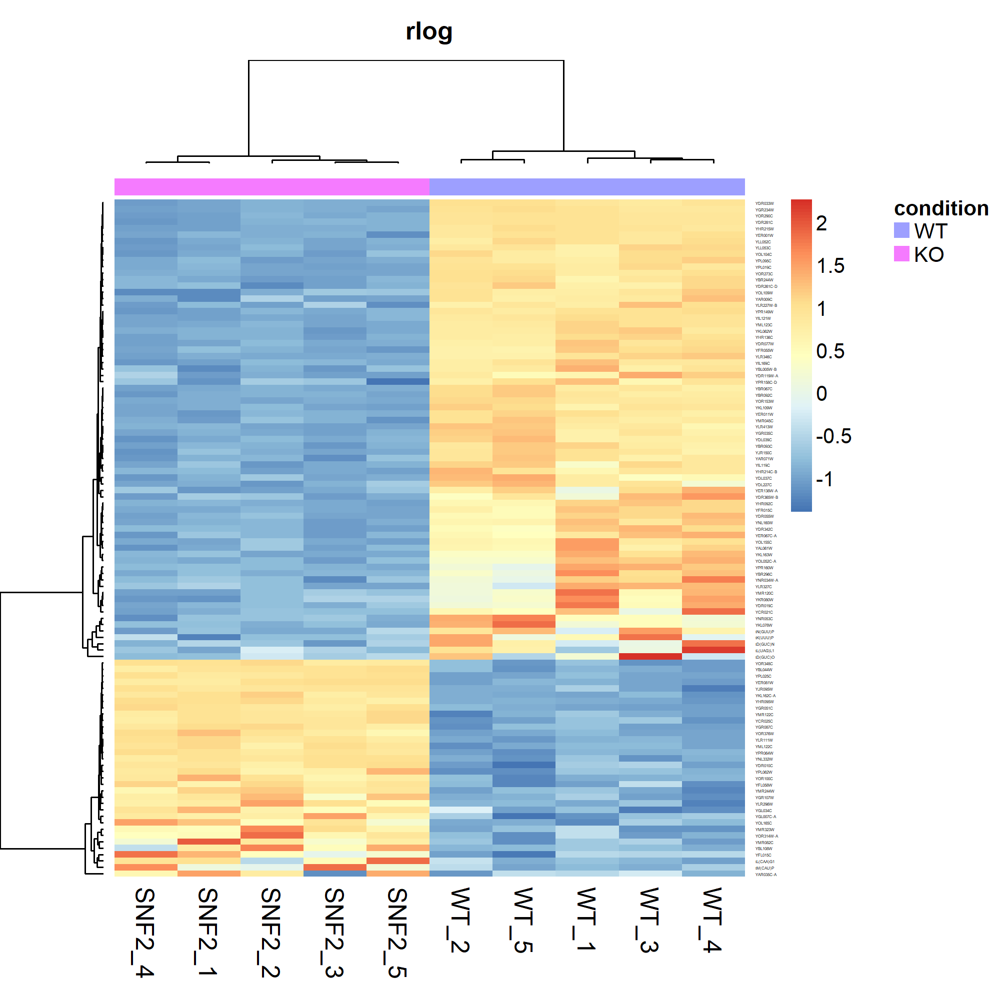

```{r setup, include=FALSE}
knitr::opts_chunk$set(echo = TRUE)
```

# Introduction

This workflow tutorial uses the R package [`DESeq2`](https://genomebiology.biomedcentral.com/articles/10.1186/s13059-014-0550-8) to perform genel-level RNA-Seq analysis, starting from a counts matrix. This workflow does not include the upstream pre-processing steps (fastQ libraries QC, reads alignment, transcript quantification, etc.).

The original dataset is from a systematic study comparing various RNA-Seq tools, using RNA-Seq libraries prepared from yeast _snf2_ knock-out versus wildtype ([Gierlinski et al. 2015](https://academic.oup.com/bioinformatics/article/31/22/3625/240923) and [Schurch et al. 2016](https://rnajournal.cshlp.org/content/22/6/839.full?sid=bdf6f07f-7f72-413b-b0c5-e32579faecac)).

The dataset used in this tutorial is a pre-processed subset of the original study. The file is called `featCounts_genes.txt` and can be downloaded from the [RNA-seq Analysis Workshop Course Materials at Weill Cornell Medical College](https://chagall.med.cornell.edu/RNASEQcourse/). For convenience, the file is also available in the `/data` directory of this repo.

# Data Import and Pre-processing

```{r}
library(tidyverse)

# import counts matrix
counts <- read.table(file = "./data/featCounts_genes.txt",
                     sep = '\t',
                     header = TRUE,
                     comment.char = '#')

# inspect imported data
str(counts)
```
  
  
## Creating a counts matrix

The data set is a dataframe with 7126 rows (genes) by 16 columnns (samples). We need to convert it to a counts matrix with the gene names as rownames and sample (library) names as column names.

```{r}
# get column (sample) names
colnames(counts)
```
  

We will not be concerned with genomic coordinates, so we will exclude the __Chr__, __Start__, __End__, __Strand__, and __Length__ columns. Also, the sample names are very long and cumbersome. We want to rename them.

```{r}
# Geneid to rownames
rownames(counts) <- counts$Geneid

# drop columns 1-6
counts <- counts[, -c(1:6)]

# rename samples
colnames(counts) <- c("SNF2_1", "SNF2_2", "SNF2_3", "SNF2_4", "SNF2_5", "WT_1", "WT_2", "WT_3",  "WT_4",  "WT_5")

# double check
head(counts)
```


```{r}
# convert to matrix
counts <- Matrix::as.matrix(counts)

# remove genes with all-zero counts
counts <- counts[rowSums(counts) > 0, ]

# double check
class(counts)
str(counts)
```
  

Note that the data is now a counts matrix with 6680 rows. We removed 446 genes that did not have any read counts. Although their removal is unnecessary for downstream analysis, such zero-count genes do not provide any information and consume computational resources.


## Creating metadata

In addition to a matrix of read counts, DESeq2 also needs to know the experimental design, or meta-data. At minimum, the meta-data is a dataframe with the sample names as its `row.names`. Additional information, such as treatment conditions, biological/technical replicates, etc. can be embedded.

```{r}
# group samples into their treatment condition
assignCondition <- function(sample_names)
{
  return(ifelse(grepl(pattern = "SNF2", x = sample_names), "KO",
                    ifelse(grepl(pattern = "WT", x = sample_names), "WT",
                    "Unknown")))
}

# create metadata df
metaData <- data.frame(row.names = colnames(counts),
                       condition = assignCondition(colnames(counts)))

# check
metaData
```
  

We have now grouped knock-out and wildtype samples to the __KO__ and __WT__ conditions, respectively.


## Define experimental conditions: groupings and baseline condition.

Later when we perform differential gene expresion analysis, we want to see the effect of _snf2_ knockout on global gene expression. Therefore, we set the __WT__ genotype as the baseline (i.e. "control") group. Any change in a gene's expression in _snf2_ cells would then be relative to the wildtype background. The R function `relevel()` allows us to define the baseline group.

```{r}
# set wildtype as baseline group
metaData$condition <- relevel(x = metaData$condition, ref = "WT")

# equivalent code
# factor(x = metaData$condition, levels = c("WT", "KO"))

# check
metaData$condition
```
  

We know __WT__ is the baseline because it is listed as the first level.


## Creating the `DESeqDataSet` object

RNA-Seq analysis with `DESeq2` begins with creation of a `DESeqDataSet` object. This is a container that will store just about everything related to the dataset, including the raw counts matrix, metadata, additional user-defined information, and results of various analyses results.

`DESeq2` can accept multiple data formats as input. We use the `DESeq2::DESeqDataSetFromMatrix()` constructor to create a `DESeqDataSet` object called `dds` from the counts matrix and meta-data dataframe we prepared above.

```{r}
library(DESeq2)

dds <- DESeq2::DESeqDataSetFromMatrix(countData = counts,    # counts matrix
                                      colData = metaData,    # metadata
                                      design = ~ condition)  # experimental design
# check dds object
str(dds)
```
  

Because a `DESeqDataSet` object extends the `SummarizedExperiment` class, we can use accessors from `SummarizedExperiment` to retrieve various `DESeqDataSet` slots.

It is a good idea to check that the created `DESeqDataSet` object contains the correct information.

```{r}
# check sample information
SummarizedExperiment::colData(dds) %>% head()
```
  

Check counts matrix stored in `dds` is identical to original `counts` matrix.

```{r}
# peek at counts matrix stored in dds
SummarizedExperiment::assay(x = dds, i = "counts") %>% head() # equivalent to DESEq2::counts(dds)

# peek at original counts matrix
head(counts)

# check the two matrices are identical
all.equal(target = counts,
          current = SummarizedExperiment::assay(x = dds, i = "counts"))
```
  


# Normalizing for Library Sequencing Depth

Ideally, every sample should be sequenced to the same depth (i.e. have same number of sequencing reads). However, the workflow for preparing an RNA-Seq library for sequencing is complex. And additional sources of variation are introduced during the actual NGS sequencing steps. As a result, technical variations during the library generation and sequencing phases can lead to differences in sequencing depth. Such differences must be corrected so they do not mask the underlying (real) biological effect between conditions (i.e. KO versus WT)

Let's look at differences in raw counts between each library.

```{r}
colSums(DESeq2::counts(dds))
```
  

There are many strategies to correct for differences in library size. The procedure implemented in `DESeq2` is described in [Anders and Huber, 2010.](https://genomebiology.biomedcentral.com/articles/10.1186/gb-2010-11-10-r106)

Using the `DESeq2::estimateSizeFactors()` function, we can calculate library size factors and store them in the `dds` object.

```{r}
# calculate sizeFactors and add the info to the dds object
dds <- DESeq2::estimateSizeFactors(dds)

# depth-normalized libraries
counts_norm <- DESeq2::counts(dds, normalized = TRUE)

# check
colSums(counts_norm)
```
  

Display the size factors for each sample.

```{r}
sizeFactors <- DESeq2::sizeFactors(dds)

sizeFactors
```
  

To manually normalize each sample, divide its raw counts by its size factor.

```{r}
colSums(DESeq2::counts(dds)) / sizeFactors
```
  

## Visualizing Sequencing Depth-Corrected Libraries

### Boxplots
To see the effect of library size normalization, we can boxplot the distributions raw versus normalized read counts for each sample.

```{r}
counts_boxplot <- function(counts_mat, normalized)
{
  as.data.frame(counts_mat) %>% 
    tibble::rownames_to_column(var = "gene") %>% 
    tidyr::pivot_longer(-gene, names_to = "sample", values_to = "count") %>% 
    dplyr::mutate(condition = assignCondition(sample), normalization = normalized)
}

ggplot2::ggplot(data = dplyr::bind_rows(counts_boxplot(SummarizedExperiment::assay(dds), "Raw"), 
                                        counts_boxplot(counts_norm, "Depth-Normalized")) %>% 
                  dplyr::mutate(normalization = factor(normalization, levels = c("Raw", "Depth-Normalized")))) +
  ggplot2::geom_boxplot(aes(x = sample, 
                            y = log2(count+1),
                            fill = condition)) +
  ggplot2::facet_grid(. ~ normalization) +
  ggplot2::labs(title = "Sequencing Depth Normalization",
                x = "Sample",
                y = "log2(readCount + 1)") +
  ggplot2::theme(plot.title = element_text(hjust = 0.5, size = 14, face = "bold"),
                 axis.text.x = element_text(angle = 90, hjust = 1))
```
  
### Density Plots

An equivalent visualization is to plot the density of raw versus depth-normalized read counts.

```{r}
counts_distro <- function(counts_mat, normalized) 
{
  apply(X = as.data.frame(counts_mat), MARGIN = c(1,2), FUN = function(x) {log2(x+1)}) %>% 
    as.data.frame() %>%
    tibble::rownames_to_column(var = "orf") %>%
    tidyr::pivot_longer(-orf, names_to = "sample", values_to = "log2_counts") %>%
    dplyr::mutate(normalization = normalized)
}

distro_joined <- dplyr::bind_rows(counts_distro(SummarizedExperiment::assay(dds), "Raw"), 
                                  counts_distro(counts_norm, "Depth-Normalized"))

distro_joined$normalization <- factor(x = distro_joined$normalization, 
                                        levels = c("Raw", "Depth-Normalized"))

ggplot2::ggplot(data = distro_joined, 
                mapping = aes(x = log2_counts, color = sample)) +
  ggplot2::geom_density() +
  ggplot2::facet_grid(facets = normalization ~., scales = "free") +
  ggplot2::labs(title = "Read Count Distribution",
                x = "log2(counts+1)", 
                y = "Density") +
  ggplot2::theme(plot.title = element_text(hjust = 0.5, size = 14, face = "bold"),
                 axis.text.x = element_text(angle = 90, hjust = 1),
                 legend.position = "none")
```
  

# Data Transformation (i.e. Feature Scaling)

In addition to normalizing for sequencing depth, it is essential to transform (i.e. scale) expression values. This is because there can be a large dynamic range in expression values between genes. As a result, very highly expressed genes can overwhelm the signal from lowly expressed genes in certain statistical methods. Below are three common transformmation techniques used in RNA-Seq.

## Pseudo-log2 Transformation of Depth-Normalized Counts.

One common scaling method is the so-called pseudo-log2 transformation. We add `1` to each _sequencing depth-normalized_ count and take its log2.

```{r}
counts_norm_log2 <-log2(counts_norm + 1)

# check
head(counts_norm_log2)
```
  

`DESeq2` has the convenience method `normTransform()` for performing the equivalent operation. Note that we need to provide the __raw__ counts matrix in `dds` object. The resulting object is a `DESeqTransform` object and must be accessed using `SummarizedExperiment::assay()`, not `DESeq2::counts()`.

```{r}
# alternative to above
dds_log2 <- DESeq2::normTransform(object = dds,
                                  f = log2,     # function to apply
                                  pc = 1)       # pseudocount

head(SummarizedExperiment::assay(dds_log2))
```
  

Check equivalence of the two methods.

```{r}
all.equal(counts_norm_log2, assay(dds_log2))
```
  

## Regularized log (rlog) Transformation

The `DESeq2::rlog()` function performs rlog transformation on the raw counts matrix. It automatically performs  depth-normalization and conversion to the log2 scale.

```{r}
dds_rlog <- DESeq2::rlog(object = dds, blind = FALSE)

counts_rlog <- SummarizedExperiment::assay(dds_rlog)

head(counts_rlog)
```
  

## Variance Stabilization Transformation (VST)

The `DESeq2::vst()` function performs variance stabilization transformation on the raw counts matrix. It automatically performs depth-normalization and conversion to the log2 scale.

```{r}
dds_vst <- DESeq2::vst(object = dds, blind = FALSE)

counts_vst <- SummarizedExperiment::assay(dds_vst)

head(counts_vst)
```
  

## Visually compare transformation procedures.

We can compare the various transformation procedures by plotting the transformed expression values (i.e. read counts) of one sample against another.

NOTE: In the below code chunk, to compare any two samples, enter the sample's index number into the variable `!!sym(samples[]`. For example, in the code chunk below, we've plotted samples WT_5 (`!!sym(samples[10])` and WT_4 (`!!sym(samples[9]`)

```{r}
library(hexbin)

samples <- colnames(counts)

plot_counts_log2 <- counts_norm_log2 %>% 
  tibble::as_tibble() %>%
  dplyr::mutate(Mean = rowMeans(counts_norm_log2),
                Variance = rowVars(counts_norm_log2),
                transformation = "log2")

plot_counts_rlog <- counts_rlog %>% 
  tibble::as_tibble() %>%
  dplyr::mutate(Mean = rowMeans(counts_rlog),
                Variance = rowVars(counts_rlog),
                transformation = "rlog")

plot_counts_vst <- counts_vst %>% 
  tibble::as_tibble() %>%
  dplyr::mutate(Mean = rowMeans(counts_vst),
                Variance = rowVars(counts_vst),
                transformation = "VST")

# scatter plot any two samples we want
ggplot2::ggplot(data = dplyr::bind_rows(plot_counts_log2, plot_counts_rlog, plot_counts_vst),
                mapping = aes(x = !!sym(samples[10]), y = !!sym(samples[9]))) +
  ggplot2::geom_hex(bins = 100) +
  ggplot2::coord_fixed() +
  ggplot2::facet_grid(. ~ transformation) +
  ggplot2::ggtitle("Comparison of Transformation Procedures") +
  ggplot2::theme(plot.title = element_text(hjust = 0.5, size = 14, face = "bold"),
                 aspect.ratio = 1,
                 plot.margin = unit(c(0,1,0,1),"cm"))
```
  

As can be seen, rlog and VST transformations shrink extreme (very low and very high)values compared to pseudo-log2 transformation.

```{r, include = FALSE}
plot_mv <- dplyr::bind_rows(plot_counts_log2, plot_counts_rlog, plot_counts_vst) %>% 
  dplyr::select(Mean, Variance, transformation)

ggplot2::ggplot(data = plot_mv,
                mapping = aes(x = Mean, y = Variance)) +
  # ggplot2::geom_point(size = 0.5) +
  ggplot2::geom_hex(bins = 75) +
  # ggplot2::coord_fixed() +
  ggplot2::facet_grid(transformation ~ .) +
  ggplot2::ylim(c(0, 4)) +
  ggplot2::theme(aspect.ratio = 1)
```
  

## Mean-Variance Relationship

Many statistical testing procedures assume _homoschedasticity_, that the variance does not vary with the mean for a set of observations (i.e. genes). However, often in biological systems, there is a large dynamic range in expression between genes that can result in non-constant variance at extreme values of the mean. This is referred to as _heteroschedasticity_.

A mean-variance plot can reveal the presence of _heteroschedasticity_.

```{r}
library(vsn)
library(gridExtra)

plot_mv <- function(DESeqTransform, transformation)
{
  vsn::meanSdPlot(x = DESeqTransform, ranks = FALSE, plot = FALSE, bins = 75) %>% 
    .$gg + 
    ggplot2::ggtitle(transformation) + 
    ggplot2::xlim(c(0, 17.5)) +
    ggplot2::ylim(c(0, 3)) +
    ggplot2::theme(plot.title = element_text(hjust = 0.5)) + 
    ggplot2::theme(aspect.ratio = 1,
                   legend.position = "none", 
                   plot.margin = margin(0,20,1,1),
                   axis.title = element_blank())
}

mv_plots <- list(
  mv_log2 <- plot_mv(counts_norm_log2, "log2"),
  mv_rlog <- plot_mv(counts_rlog, "rlog"),
  mv_vst <- plot_mv(counts_vst, "VST"))

gridExtra::grid.arrange(grobs = mv_plots,
                        nrow= 1,
                        top = "Mean-Variance Relationship In Gene Expression",
                        left = "SD",
                        bottom = "Mean")
```
  

In the plots above, each dot (in this case, a hexbin) represents each gene's expression mean (X-axis) versus variance (Y-axis). The red line indicates the running median. If the data were homoschedastic, the red line would be horizontal. However, we see that this is not the case. Each of the three transformation procedures attemps to correct for heteroschedasticity to varying degrees of success.  

- log2 transformation suffers from high heteroschedasticity at low expression levels. This results in higher noise-to-signal ratio for lowly expressed genes.
- rlog transformation does a better job at correcting for heteroschedasticity and shares a similar dynamic range as log2 transformation.
- VST transformation, like rlog, corrects for heteroschedasticity better than log2. However, the dynamic range for VST is limited. In particular, very lowly expressed genes are excluded.


```{r, include = FALSE}
blah_log2 <- vsn::meanSdPlot(x = counts_norm_log2, ranks = FALSE, plot = FALSE, bins = 75) %>% 
  tibble::enframe(x = .) %>%
  dplyr::mutate(transformation = "log2")

ggplot() +
  geom_hex(mapping = aes(x = blah_log2$value[blah_log2$name == "px"] %>% unlist(), 
                         y = blah_log2$value[blah_log2$name == "py"] %>% unlist()),
           bins = 75)
  geom_line(aes(x = quantile, y = sd), color = "red")
```
  

# Exploratory Data Analysis

Before proceding to perform differential gene expression (DGE) analysis, it is essential to peruse through the data. Exploratory analysis provides a means of checking the data set to ensure that it makes (biological) sense in the context of the experimental design.

## Sanity Check: SNF2 expression in knockout vs wildtype

The most obvious check is to see if expression of _SNF_ is depleted/reduced in the knock-out samples. We also want to check a gene that we think might not be affected by _SNF2_ knock-out. As _SNF2_ is the catalytic subunit of the SWI/SNF chromatin remodeling complex, its loss-of-function is expected to globally affect many genes. However, a house-keeping gene, such as _UBC6_, would be expected to remain constant over a wide-range of physiological conditions [Teste et al, 2009](https://bmcmolbiol.biomedcentral.com/articles/10.1186/1471-2199-10-99).

The "gene" names in the counts matrix are actually ORF identifiers. We need to pull out the two rows corresponding to their common names _SNF2_ and _UBC6_. To do this, we need to map the ORFs to their common gene names.

```{r}
library(org.Sc.sgd.db)

# map ORF identifiers to common names
orf2genes <- AnnotationDbi::select(x = org.Sc.sgd.db,              # database
                                   keys = keys(org.Sc.sgd.db),     # retrieve all ORF identifiers
                                   keytype = "ORF",
                                   columns = "GENENAME")

orf_snf2 <- orf2genes[which(orf2genes$GENENAME == "SNF2"), ]$ORF
orf_hk_gene <- orf2genes[which(orf2genes$GENENAME == "UBC6"), ]$ORF

snf2 <- counts_norm[orf_snf2, ] %>% as.data.frame() %>% 
  tibble::rownames_to_column(var = "sample") %>% 
  dplyr::mutate(gene = "SNF2") %>% 
  dplyr::rename(count = colnames(.)[2])


hk_gene <- counts_norm[orf_hk_gene, ] %>% as.data.frame() %>% 
  tibble::rownames_to_column(var = "sample") %>% 
  dplyr::mutate(gene = "UBC6") %>% 
  dplyr::rename(count = colnames(.)[2])

ggplot2::ggplot(data = dplyr::bind_rows(snf2, hk_gene)) +
  ggplot2::geom_col(aes(x = sample, y = count)) +
  ggplot2::facet_grid(gene ~., scale = "free_y") +
  ggplot2::labs(title = "Sanity Check: SNF2, UBC6",
                y = "Normalized Count") +
  ggplot2::theme(plot.title = element_text(hjust = 0.5, size = 14, face = "bold"),
                 axis.text.x = element_text(angle = 90, hjust = 1),
                 axis.title.x = element_blank())
```
  

We see that _SNF2_ is indeed depleted in the knock-out samples but not in the wildtype. In contrast, _UBC6_ is unaffected in both groups.


## Principal Component Analysis

Principal Component Analysis (PCA) is a dimensionality reduction technique that is useful for exploring variations between samples. It is useful for assigning samples into groups based on shared features (i.e. gene expression profile). For example, there should be greater variation (in the transcription profiles) between the knock-out and wildtype groups than between samples within the same group.

```{r, include=FALSE}
DESeq2::plotPCA(object = dds_rlog,
                intgroup = "condition") # grouping variable
```

```{r, include = FALSE}
pca_rlog <- DESeq2::plotPCA(object = dds_rlog,
                            intgroup = "condition",
                            returnData = TRUE)  # don't plot, instead return the data

pca_rlog

# get % variance from PC1 and PC2
percentVar <- 100*attr(x = pca_rlog, which = "percentVar") %>% round(digits = 3)

# generate plot
ggplot2::ggplot(data = pca_rlog, aes(x = PC1, y = PC2, color = condition, shape = condition)) +
  ggplot2::geom_point(size = 3) +
  ggplot2::geom_text(aes(label = name), size = 3, check_overlap = TRUE, nudge_y = -0.5) +
  ggplot2::labs(title = "PCA: rlog-transformed",
                x = paste("PC1: ", percentVar[1], "% variance"),
                y = paste("PC2: ", percentVar[2], "% variance"))
  ggplot2::theme(plot.title = element_text(hjust = 0.5, size = 14, face = "bold"),
                 axis.text.x = element_text(angle = 90, hjust = 1),
                 axis.title.x = element_blank())
```
  

We can compare how each of the three transformation procedures affect PCA analysis. We'll use the `DESeq2::plotPCA()` function to perform PCA analsys, but will plot manually for fine-grained control.

Because we want to perform the same procedure on each of the three transformed datasets, we can abstract the code into a function. This reduces typing, verbosity, and error.

```{r}
# function to PCA-plot any transformed dataset
pca_plot <- function(counts_mat, transformation)
{
  pca <- DESeq2::plotPCA(object = counts_mat,
                         intgroup = "condition",
                         returnData = TRUE)  # don't plot, instead return the data
  
  # get percent variance from PC1 and PC2
  percent_variance <- 100*attr(x = pca, which = "percentVar") %>% round(2)
  
  # generate plot
  return(
    ggplot2::ggplot(data = pca, aes(x = PC1, y = PC2, color = condition, shape = condition)) +
      ggplot2::geom_point(size = 3) +
      ggplot2::geom_text(aes(label = name), size = 3, check_overlap = TRUE, 
                         nudge_x = ifelse(pca$condition == "KO", 6, -6)) +
      ggplot2::labs(title = transformation,
                    x = paste(percent_variance[1], "%"),
                    y = paste(percent_variance[2], "%")) +
      ggplot2::theme(plot.title = element_text(hjust = 0.5, size = 12, face = "bold"),
                     axis.text.x = element_text(angle = 90, hjust = 1),
                     plot.margin=unit(c(1,1,-0.5,1), "cm"),
                     legend.position = "None",
                     aspect.ratio = 1)
    )
}

# compare transformations
pca_plots <- list(
  pca_raw <- pca_plot(DESeq2::DESeqTransform(dds), "raw"),  # input into plotPCA() requires DESeqTransform object
  pca_log2 <- pca_plot(dds_log2, "log2"),
  pca_rlog <- pca_plot(dds_rlog, "rlog"),
  pca_vst <- pca_plot(dds_vst, "VST"))

gridExtra::grid.arrange(grobs = lapply(pca_plots, "+", ggplot2::theme(plot.margin = margin(1,1,1,1))),
                        nrow = 2,
                        top = "PCA of Transformation Procedures",
                        left = "PC2",
                        bottom = "PC1")
```
  

In the raw dataset, PC1 is unable to resolve the two groups (WT vs KO). Instead, they are resolved by PC2, which has only 32% of the total variance.

In contrast, transformation allows the most variance to be captured by the first principal component. We see that regardless of the transformation applied, PC1 is able to resolve the samples into the two expected groups, with rlog and VST resulting in greater PC1 variance compared to log2. The rlog and VST transformations are identical along PC1 and PC2.

### Scree Plot

Another way to visualize PCA analysis is to plot the variances as a function of the principal components. This is also called a "scree" plot. The "elbow" indicates the highest principal component beyond which variance cannot be resolved. Below is a scree plot for the VST transformed data.

```{r}
pca_rlog <- prcomp(t(SummarizedExperiment::assay(dds_vst)))
plot(x = pca_rlog, main = "Scree plot: VST transformation", type = 'l')
title(xlab = "Principal Component")
```
  

For the VST transformed data, the first 3-4 principal components are the most informative.


# Differential Gene Expression Analysis

The goal of DGE analysis is to determine the set of genes that are expressed at different levels between two or more conditions (i.e. KO versus WT). [Chapter 6 of this RNA-Seq workshop course note](https://chagall.med.cornell.edu/RNASEQcourse/Intro2RNAseq.pdf) provides an excellent introduction to the principles behind DGE analysis. At the most basic level, DGE comprises three steps:

__1. Correct for differences in library sizes (sequencing depth)__

__2. For each gene, estimate the magnitude of the difference in gene expression between conditions (i.e. KO versus WT)__.  
This is done by fitting a GLM to some statistcal distribution. `DESeq2` uses the Negative Binomial distribution.

__3. Determine the statistical significance of the estimate in Step 2 and control for genome-wide hypothesis testing.__


## Run DGE Analysis

We can perform DGE analysis in `DESeq2` by providing the `dds` object to the `DESeq2::DESeq()` function.

```{r}
# run DGE
dds <- DESeq2::DESeq(dds)
```
  

Note that the read counts in `dds` need to be __*raw*__ (un-normalized, untransformed). This is because invoking `DESeq2::DESeq(dds)` automatically performs the three DGE steps outlined above by internally calling the following functions:

1. `dds <- DESeq2::estimateSizeFactors(dds)` ==> correct for sequencing-depth
2. `dds <- DESeq2::estimateDispersions(dds)` ==> estimate dispersions for each gene across samples, using Negative Binomial distribution
3. `dds <- DESeq2::nbinomWaldTest(dds)`      ==> test significance dispersion estimates


Results of DGE analysis can be extracted with the `DESeq2::results()` function.

```{r}
dds_DGE <- DESeq2::results(object = dds, 
                           independentFiltering = TRUE, # don't test low-count genes (default = TRUE)
                           pAdjustMethod = "BH",        # correct for genome-wide hypothesis (default = "BH")
                           alpha = 0.05)                # override default FDR cut-off of 0.1

dds_DGE
```
  

The description `condition KO vs WT` indicates that the reference level is wildtype (which is what we have set when we defined the meta-data object) and that fold-change is relative to the reference. That is,  

$$log2FoldChange = \log_2(KO/WT)$$


A description of each column can be found with the commond below.

```{r}
SummarizedExperiment::mcols(dds_DGE)$description
```
  

Because DGE involves genome-wide hypothesis testing, the adjusted p-value `padj`, instead of the `pvalue`, should be relied upon in judging tests of statistical significance. However, when the `independentFiltering` parameter is set to `TRUE` (as is the case above), `DESeq2`  sets `padj` to the value `NA` for genes with very low expression (i.e. YDL247W-A, YAR070C). Lowly expressed genes have high dispersion (resulting in high noise-to-signal) that make it difficult to discern real differences in expression between conditions. The [DESEq2 vignette](http://www.bioconductor.org/packages/release/bioc/vignettes/DESeq2/inst/doc/DESeq2.html#indfilttheory) contains detailed information on independent filtering.


## Exploratory Analysis of DGE Results

We can see the effect of adjusting for genome-wide hypothesis testing (using the Benjamini-Hochberg method) by comparing the unadjusted versus the adjusted p-values.

### Histogram of p-values

```{r}
# hist(dds_DGE$padj, col = "gray", main = "DGE: Adjusted p-values.")

pvals <- as.data.frame(dds_DGE)
  
pvals <- dplyr::bind_rows(pvals %>% dplyr::transmute(val = pvalue, FDR = "none"),
                          pvals %>% dplyr::transmute(val = padj, FDR = "BH"))
pvals$FDR <- factor(x = pvals$FDR, levels = c("none", "BH"))

ggplot2::ggplot(data = pvals, aes(x = val, fill = FDR)) +
  ggplot2::stat_bin(geom = "bar", bins = 30, alpha = 0.5, position="identity") +
  ggplot2::labs(title = "Comparison of FDR-adjusted vs unadjusted p-values",
                x = "p-value",
                y = "Frequency") +
  ggplot2::theme(plot.title = element_text(hjust = 0.5, size = 14, face = "bold"),
                 axis.text.x = element_text(angle = 90, hjust = 1))
```
  

The `dds_DGE` object contains ORF identifiers. Sometimes it is preferred to use the common gene name instead. Therefore, we need to map each ORF to its common gene name.

```{r}
dds_DGE <- dplyr::left_join(x =  dds_DGE %>% as.data.frame() %>% tibble::rownames_to_column(var = "ORF"), 
                                  y = orf2genes,
                                  by = "ORF")

head(dds_DGE)
```
  

We can extract a list of DGE genes based on a certain cut-off criteria. For example, this code will extract genes whose expression is changed more than two-fold (in either direction) in the __snf2__ background and with an adjusted p-value less than 0.05

```{r}
dds_DGE %>% dplyr::filter(padj < 0.05, abs(log2FoldChange) > 1.0) %>% head()
```
  

### MA-plot: Average expression versus fold-change.

An MA-plot is a scatter plot of a gene's average expression (A, X-axis) against its fold change between conditions (M, Y-axis).  

$$M = \log_2(KO/WT) = \log_2(KO)-\log_2(WT)$$
$$A = \frac{1}{2}\log_2(KO \cdot WT) = \frac{1}{2}[\log_2(KO) + \log_2(WT)]$$

`DESeq2` has the internal `plotMA()` function to quickly generate an MA-plot. However, plotting manually allows for more fine-grained control.

```{r}
ggplot2::ggplot(data = dds_DGE %>% dplyr::filter(!is.na(padj))) +
  ggplot2::geom_point(mapping = aes(x = log10(baseMean),
                          y = log2FoldChange,
                          color = padj < 0.05),
                      size = 0.75) +
  ggrepel::geom_text_repel(aes(x = log10(baseMean),
                               y = log2FoldChange,
                             label = ifelse(GENENAME == "SNF2" | GENENAME == "UBC6", GENENAME, '')),
                           size = 3) +
  ggplot2::geom_hline(yintercept = c(-2, 2), linetype = "dashed", color = "gray") +
  ggplot2::labs(title = "MA-Plot: Gene Expression Change in SNF2 Knockout",
                x = "Expression (log10[Mean of Normalized Counts])",
                y = "log2FoldChange") +
  ggplot2::theme(plot.title = element_text(hjust = 0.5, size = 14, face = "bold"))
```
  

Note that both _SNF2_ and _UBC6_ have comparable mean expression. However, only expression of _SNF2_ is reduced in the knock-out genotype, as we would expect.


### Volcano Plot

A volcano plot is a plot of a gene's fold-change on the horizontal-axis (i.e. log2FoldChange) against its adjusted p-value on the vertical-axis. Because the adjusted p-values can be very small, it is more convenient to plot its `-log10` instead.

```{r}
ggplot2::ggplot(data = dds_DGE %>% dplyr::filter(!is.na(padj))) +
  ggplot2::geom_point(mapping = aes(x = log2FoldChange,
                                    y = -log10(padj),
                                    color = padj < 0.01),
                      size = 0.75) +
  ggplot2::geom_vline(xintercept = c(-2, 2), linetype = "dashed", color = "gray") +
  ggrepel::geom_text_repel(aes(x = log2FoldChange,
                               y = -log10(padj),
                               label = ifelse(abs(log2FoldChange) > 2 & padj < 0.01, GENENAME, '')),
                           size = 3) +
  ggplot2::labs(title = "Volcano plot: Gene Expression Change in SNF2 Knockout",
                x = "log2FoldChange",
                y = "-log10(padj)") +
  ggplot2::theme(plot.title = element_text(hjust = 0.5, size = 14, face = "bold"))
```
  

Note again that _SNF2_ expression is drastically reduced and has a highly significant adjusted p-value. It is a good idea to always check the analysis results against known ground truths.


### Heatmaps

Heatmaps give a bird's eye view and allow global trends to be easily discerned from complex data sets. Below, we use the `NMF` package to generate a heatmap for the rlog-transformed data set.

```{r}
library(NMF)

dds_DGE_sorted <- dds_DGE %>% 
  dplyr::filter(!is.na(padj) & padj < 0.05 & abs(log2FoldChange) > 2.0) %>%
  dplyr::arrange(padj)

NMF::aheatmap(x =counts_rlog[dds_DGE_sorted$ORF, ],
              main = "rlog",
              labRow = dds_DGE_sorted$ORF,
              annCol = dplyr::select(metaData, condition),       # annotation tracks on top of heatmap
              filename = "./docs/heatmap_rlog.png",  # save to file
              distfun = "pearson",   # distance metric for clustering rows and columns
              scale = "row")        # scale row values to Z-scores
```
  



# `sessionInfo()`

```{r}
sessionInfo()
```

